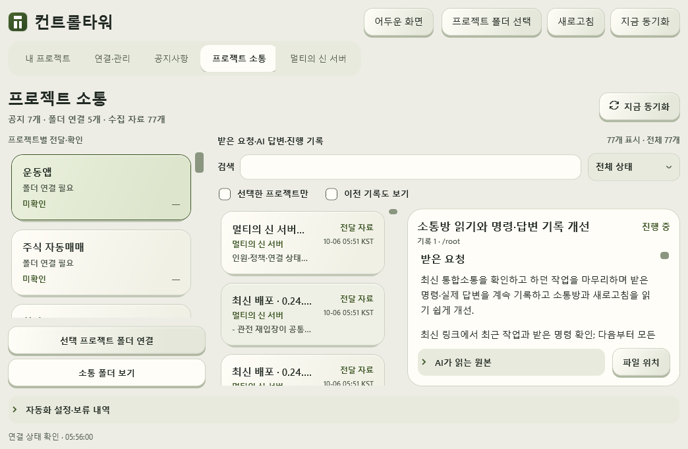
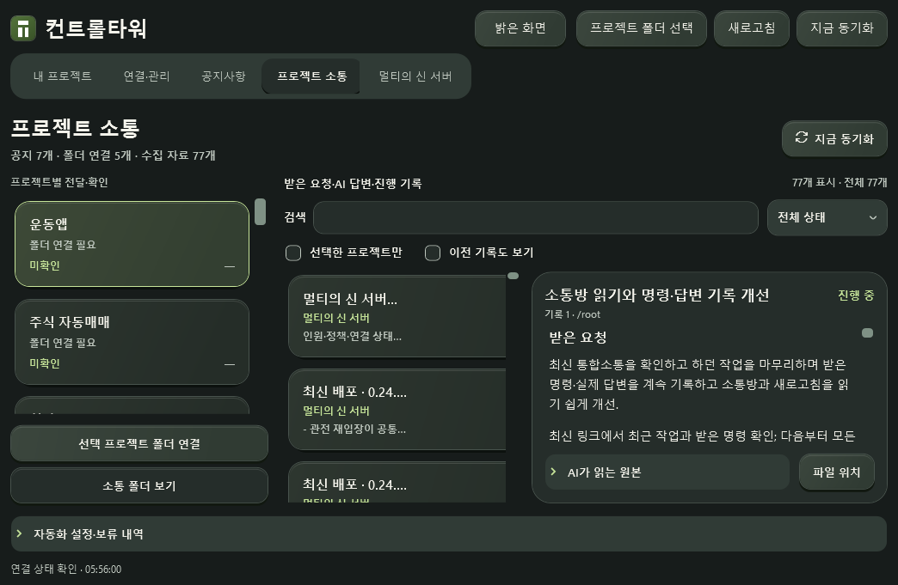

# 0.6.1 소통 기록·본문 읽기·새로고침 검증 — 2026-10-06 KST

## 받은 요청과 이전 상태
사용자는 최신 통합소통과 이전 명령 확인, 받은 명령·실제 답변 계속 기록, 다른 AI 공통 규칙, 새로고침 끊김 제거, 사람용 요약과 AI 원본 동시 읽기를 요청했습니다.
이전 0.6.0 레이어 디자인은 PR19와 설치 EXE까지 배포된 작업이었습니다. 이번에는 해당 구현 위에 소통 기록과 읽기 개선을 적용했습니다.

## 구현
- task_exchange JSON 하나를 공식 원본으로 유지합니다. 요청·실제 답변·한 일·검증·남은 일·출처를 사람이 읽는 문서로 표시합니다. 원본은 펼쳐 복사할 수 있습니다.
- 검색은 한글 Unicode escape JSON의 해석된 본문까지 포함합니다. 전체/선택 프로젝트, 상태, 최신/이전 기록 필터가 있습니다.
- 같은 ID·작성자의 최신 revision을 기본으로 표시합니다. 이전 기록은 보존하고 같은 버전의 상충 기록은 경고합니다. 충돌 해소 후 경고도 복구합니다.
- 수집 갱신·필터 후 선택과 원본 객체를 보존합니다. 불완전한 공지 목록은 마지막 정상 화면을 유지합니다.
- 800ms 아이콘 회전을 끝까지 마치며 요청 종료 시 원점으로 튀지 않습니다. 요청 상태는 실제 조회 상태로 즉시 갱신합니다. 움직임 줄이기와 Windows 설정을 존중합니다.
- 작은 창에서 본문 높이 0을 발견해 목록/본문 좌우 배치로 수정했습니다. 기술용 Markdown 주석은 사용자 본문·목록에서 숨기고 원본에 보존합니다.
- N-0007, 정책·진입 안내·템플릿·기록도우미 record/validate/render를 연결했습니다. 공지 배포·본인 작성·수집·중앙 공유·각 AI 실제 확인은 별개입니다.

## 실제 검증
- Windows Release .NET 테스트 109개 통과. 빌드 오류·경고 없음.
- Python 공지·새 기록 도우미 테스트 29개 통과.
- 최종 단일 EXE에서 1460×920/1060×720, 밝음→어두움→밝음의 33개 화면 조합 통과. 본문 최소 대비 4.8118:1.
- 휠 4개, 재탐색 후 선택·검색·펼침·스크롤 보존 통과(8→8).
- 통제한 실제 WPF 아이콘 검사: 요청 종료 전 약71도→종료 후 약137도로 이어 진행하고 한바퀴 완료 후0도로 멈춤. 움직임 줄이기0도 확인. 이는 서버 응답 성공을 대체하는 검사가 아닙니다.
- 서버 roster 조회 정상 응답도 별도로 확인했습니다. 게임 플레이·Unity 열기·오디오북 생성·영상 다운로드·Jev 왕복은 검증하지 않았습니다.
- 소통 수집 77개 확인. 오디오북 공지 파일 전달 중 쓰기 접근 거부가 보고됐으며 실제 받은공지에는 N-0007까지 존재했습니다. 일시 접근/동기화는 설치 후 재확인합니다.

최종 EXE SHA256: 5DB2C570B9AF408A3A428AAD603DE36BA620B8B5CD3D0E6CBA6AF2D2F46906D0
설치 위치: D:\A_KJ\AI\Applications\AIControlTower\AIControlTower.exe
기존 원본·프로젝트·서버·공유 원격 연결은 이동·종료하지 않습니다. 검증용 앱만 정리합니다.
설치 교체·중앙 공유 결과는 이번 작업 종료 기록으로 확인합니다.

[검증 JSON](screens-reader/ui-verification.json) · [.NET 실행 로그](screens-reader/dotnet-test.log)

