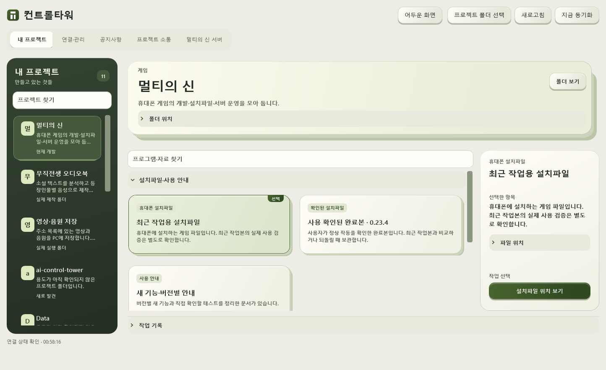
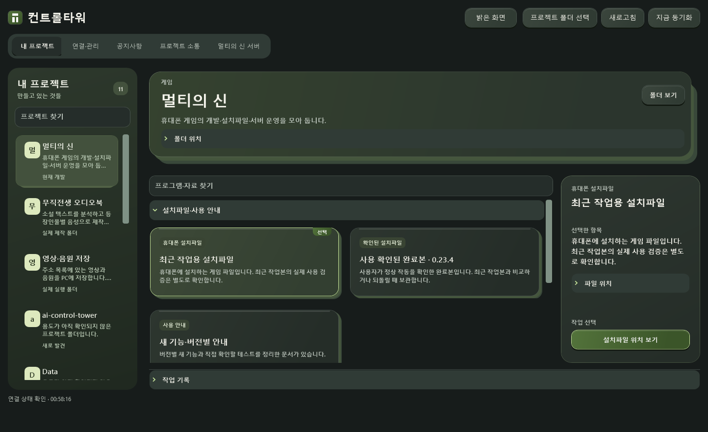
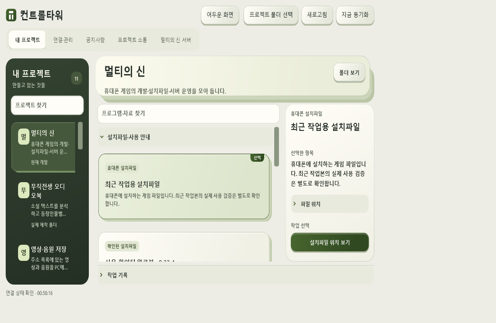
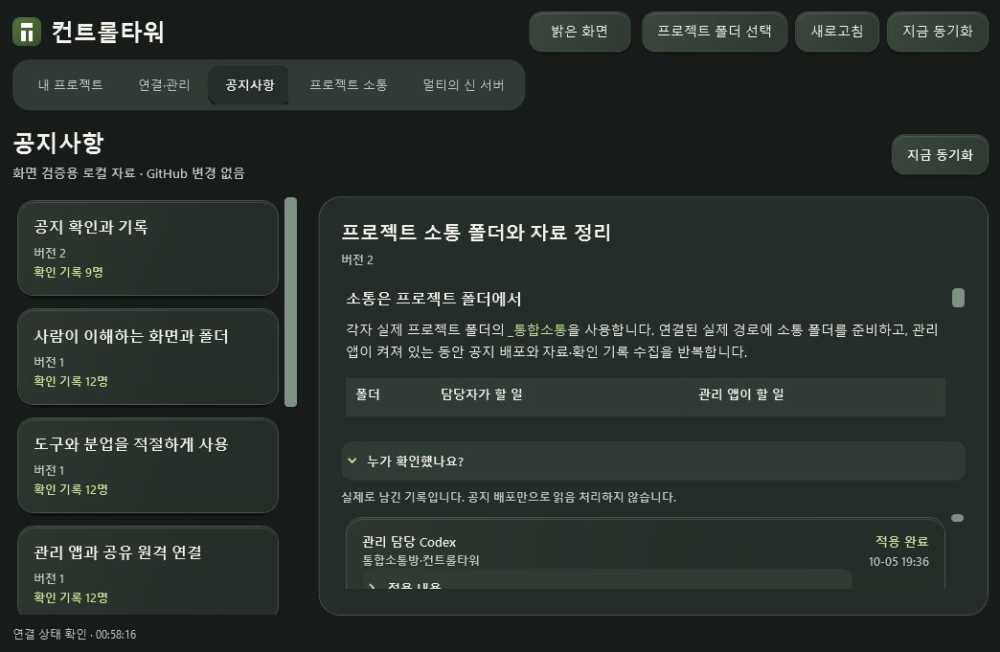

# 0.6.0 레이어 화면 개편 — 2026-10-06 KST

사용자는 추가 부분 예시 2(레이어 사이드바), 6(펼치는 목록), 7(타일 작업실), 8(겹친 작업 카드)를 우선 선택했습니다. 1은 제외하고 5의 서류철 감각은 많은 항목의 사용성을 조건으로 참고했습니다. 부분 선호는 전체 최종 디자인 승인을 뜻하지 않습니다.

## 실제 앱에 반영한 구조

- 상단 한국어 화면 전환, 왼쪽의 계속 보이는 프로젝트 목록과 검색.
- 선택한 프로젝트의 겹친 작업면과 프로그램 카드. 모든 프로젝트를 거대한 서류철로 펼치지 않습니다.
- 기능별 펼침 목록과 기본 접힌 개발·보관 자료. 카드 자동 회전 없이 직접 선택합니다.
- 긴 한글 이름은 두 줄과 전체 이름 툴팁으로 확인합니다. 프로젝트 목록은 가상화와 스크롤을 사용합니다.
- 오른쪽에서 용도와 지금 할 작업을 확인합니다. 설치파일 위치 보기·폴더 보기·실행을 구별합니다.
- 작은 창에서 공지 본문과 핵심 행동을 읽고 누를 수 있게 공간을 조정했습니다.
- 자동 발견이 다시 실행돼도 선택·프로그램 검색·선택 명령·그룹 펼침·프로젝트 스크롤 위치를 이어갑니다.

## 테마와 접근

기본은 밝은 종이·올리브 레이어입니다. 사용자가 어두운 녹색 화면으로 전환할 수 있고 설정을 저장합니다. 배경·본문·설명·상태·호버·선택·입력·드롭다운·버튼·포커스·공지 표와 링크·AI 작업 전달 창을 함께 갱신합니다. 그라데이션의 모든 지점과 실제 렌더링된 작은 글자를 4.5:1 이상으로 확인합니다.

프로젝트·선택 프로그램의 전환은 180ms 이내로 하고 자동 카드 순환을 사용하지 않습니다. Windows 애니메이션 해제와 움직임 줄이기를 존중합니다. 서버 접속자 갱신 표시와 1초 조회는 기존 실제 상태를 사용합니다. 조회 실패를 접속자 0명으로 바꾸지 않습니다.

## 참고한 구현과 적용 방식

- React Bits CardNav, Folder, MagicBento, CardSwap, StaggeredMenu: https://reactbits.dev/
- 원본 소스: https://github.com/DavidHDev/react-bits — 조사 SHA ca44b3f9ee180676a06d7de8ec6bea84cddff85b
- 겹친 탭: https://ui.aceternity.com/components/tabs
- 확장 카드: https://ui.aceternity.com/components/expandable-card
- 타일 배치: https://animata.design/docs/bento-grid
- 메뉴에서 격자로 전환: https://tympanus.net/codrops/2022/09/19/menu-to-grid-layout-animation/ — 2022년의 과거 참고 자료

React 컴포넌트를 그대로 WPF에 설치한 것이 아닙니다. 선택된 레이어·배치·상호작용을 기존 네이티브 코드의 XAML·변환·동적 테마 자원으로 새로 구현했습니다. 새 웹 런타임·유료 도구·모델 호출은 필요하지 않습니다. upstream은 MIT+Commons Clause이며 실질적인 원본 코드나 포트를 재사용하는 다음 작업은 해당 고지·재배포 제한을 확인해야 합니다.

과거 조사와 시안은 참고입니다. 다음 담당자는 현재 사용자 지시·실제 설치본·저장소를 확인하고 더 좋은 대안을 열린 기준으로 비교합니다. 원본 폴더·파일과 프로젝트 카탈로그 연결은 이 개편에서 이동하지 않았습니다.

## 검증 범위

Windows 테스트는 기존 발견·작업·소통·서버 기능과 두 테마의 그라데이션 대비, 격리된 200개 프로젝트의 검색·실제 객체 선택을 확인합니다. 실제 WPF 화면은 밝음→어두움→밝음, 1460×920/1060×720, 다섯 화면과 AI 작업 전달 창에서 대비·버튼 접근·선택 유지·휠·갱신 보존을 확인합니다.

UI 검증용 설정은 저장하지 않고 Git 준비·fetch·commit·rebase·push를 실행하지 않습니다. 강제 동기화는 진행 중인 소통 수집을 기다립니다. 공지 읽기가 실패하면 마지막 정상 내용을 유지하고 재시도 상태를 표시합니다. 자동 배포와 실제 읽음·적용을 구분하며 다른 AI를 대신 체크하지 않습니다.

실기기 게임 플레이·Unity 편집기 실행·오디오북 생성·영상 다운로드·Jev 왕복은 이 UI 변경의 검증 대상이 아닙니다. 게임 서버/원격 연결을 디자인 배포 때문에 재시작하지 않습니다.

## 확인 결과

- Windows 단위 테스트 96개 통과, 빌드 경고·오류 0개.
- 실제 WPF 테마·화면 조합 33개 통과, 본문 최소 대비 4.8118:1.
- 두 창 크기의 프로젝트·프로그램 휠 4개 통과.
- 실제 재탐색 전후 선택·검색·펼침·스크롤 유지, 스크롤 위치 7→7.
- 접속자 모니터는 이 회차에 응답하지 않았습니다. 1초 요청의 갱신/대기 회전 표시는 확인했으나 실제 닉네임·성공 시각 갱신은 이번에 재검증하지 않았고 서버를 재시작하지 않았습니다.
- 실제 설치본 교체·최종 EXE 해시·중앙 수집 여부는 프로젝트 소통함의 배포 인수인계에서 확인합니다.

