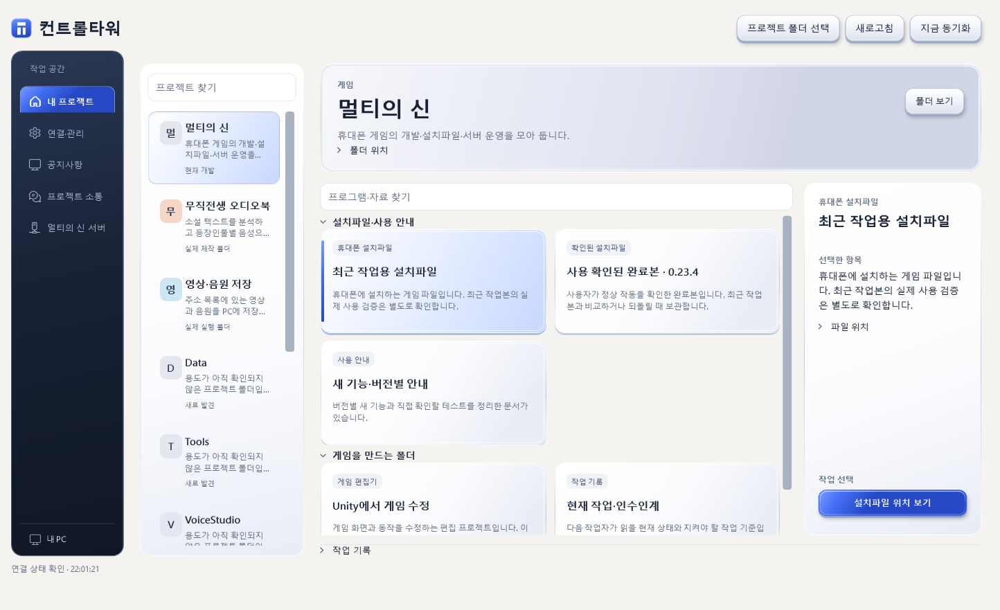
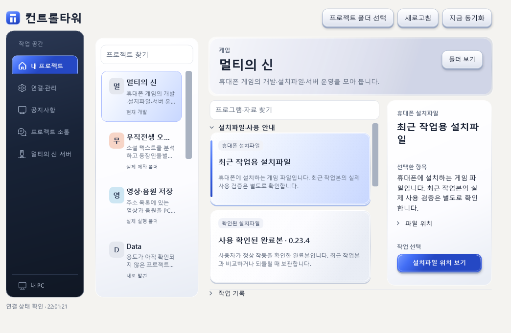

# 0.4.1 표면 표현 개편

사용자 피드백: 색상·배치와 별개로, 실선 하나와 단색 면으로만 만든 밋밋한 디자인 자체를 원하지 않습니다. 화면 구조 변경만으로 이 요구를 완료했다고 표시하지 않습니다.

## 구현

- 버튼: 아래 받침, 방향성 그라데이션, 내부 빛 반사 테두리, 접촉 그림자. hover 시 1px 상승, 누름 시 2px 하강과 받침 약화. 키보드 초점은 별도 외곽 표시, 비활성은 명확히 약화.
- 카드: 겹친 하단 가장자리, 미세한 정적 표면 질감, 방향성 조명. 선택은 측면 표시와 표면 변화, hover는 2px 상승.
- 메뉴·프로젝트 영역: 단색 면에서 재질과 조명이 있는 표면으로 변경. 설명·실제 행동을 가리지 않습니다.
- 작은 창의 긴 제목 크기를 조정해 어색한 한 글자 줄바꿈을 줄였습니다.

[Uiverse 사용자 참고 요소](https://uiverse.io/ArturCodeCraft/pink-starfish-90), [Sean Geng 공개 버튼 예제](https://seangeng.com/components/button)의 표면 레이어·내부 빛·눌림 표현을 확인했습니다. 웹 코드를 복사하지 않고 WPF로 독립 구현했습니다. 참고 당시 자료는 영구적인 최선이 아니며 새 레퍼런스와 사용자 피드백에 따라 다시 검토합니다.

## 실제 검증

2026-10-05T22:01:24.8642803+09:00. Windows native publish 성공. 큰/작은 창 프로젝트·프로그램 휠 4개 모두 0→48→0 복귀, 제목 색상·표시 6개 통과, 검색·실제 .NET 검사 성공(exit 0), 작은 창 행동 영역 검사 통과. 게임 전체 플레이·IME 수동 입력을 검증한 것으로 표시하지 않습니다. 이번 변경은 XAML과 버전이며 이전 82개 단위 테스트를 이번에 재실행했다고 주장하지 않습니다.

[원본 검증](screens-material-041/ui-verification.json)

## 인수인계

새 디자인 작업에서는 단색·실선 기본 컨트롤의 배치 변경만으로 완성이라 하지 마세요. 표면 표현과 상태별 반응을 실제 화면으로 확인하고, 가독성·초점·휠을 함께 점검합니다. 기록은 각 프로젝트 소통 폴더에 남겨 자동 수집합니다.
