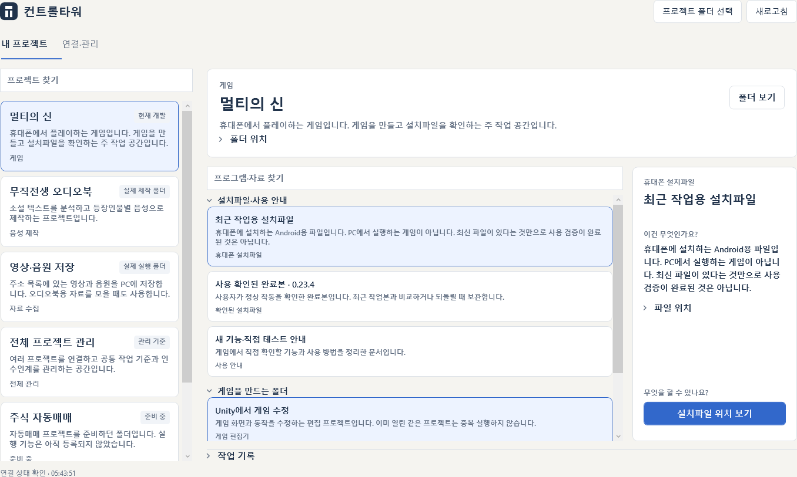
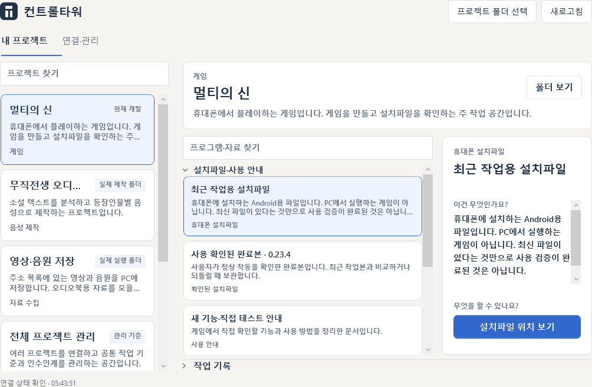
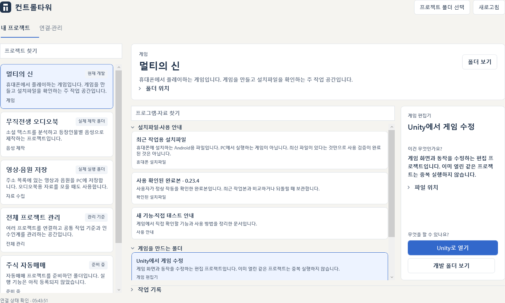
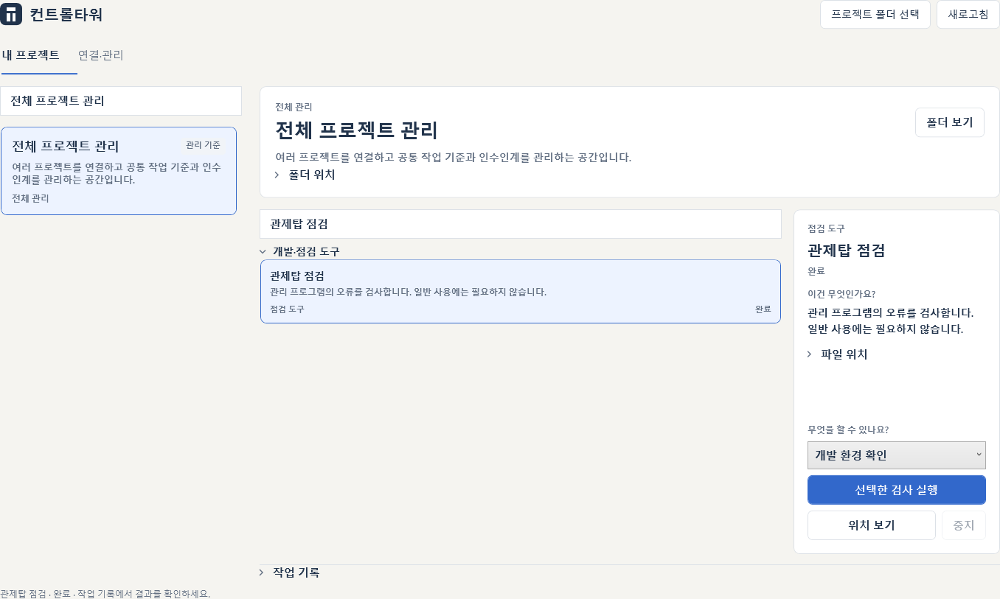
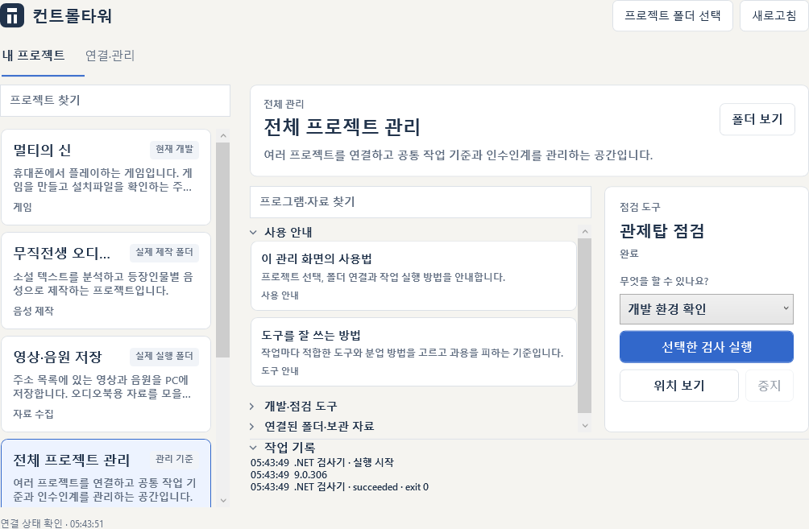
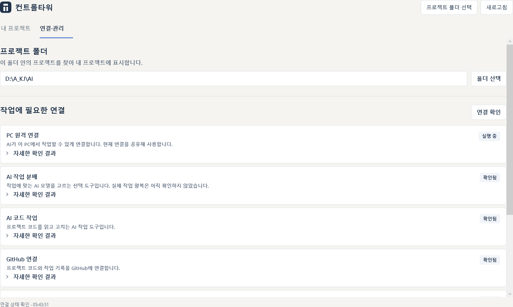

# 2026-10-05 실제 Windows 검증

최종 화면 확인: **2026-10-05 05:43 KST**, KJW Windows PC, .NET SDK 9.0.306. 실제 폴더·등록 항목·명령 결과를 사용했습니다.

## 설치본

- 위치: `D:\A_KJ\AI\Applications\AIControlTower\AIControlTower.exe`
- 버전: 0.2.0, Release, win-x64, self-contained 단일 EXE, WPF 네이티브 라이브러리 포함.
- 파일 크기: 134,656,903 bytes.
- SHA-256: `63EF0DB015C78A14FAF7FC231F8307A8412E4E9049934CD9841170E9119DB5F3`
- HKCU 자동 시작은 위 D 경로를 가리킵니다. 바탕화면의 `컨트롤타워` 바로가기도 위 설치본을 엽니다.
- 이전 설치본·시작 등록 백업은 유지했습니다. 중간 배포 폴더와 이번 배포로 생긴 분리 DLL은 정리했습니다.

## 확인한 결과

| 확인 | 결과 |
|---|---|
| Release 테스트 | **36 통과, 실패 0, 건너뜀 0** |
| 최종 publish | 성공 |
| 프로젝트 목록 | 실제 6개 프로젝트, 24개 프로그램·자료 |
| 검색 | 프로젝트·프로그램 검색 결과가 원래 항목과 같은 객체이며 실제 선택과 실행을 유지 |
| 점검 실행 | `dotnet --version` → `9.0.306`, 실제 종료 코드 0, 결과 기록 저장 |
| 보통 창 | 1420 × 900, 한국어 이름·용도·자료/프로그램 구분과 행동 확인 |
| 작은 창 | 1060 × 720, 카드 경계 수정, 명령·실행·열기·중지 버튼이 검사 패널 안에 표시 |
| 작업 기록 펼침 | 작은 창에서도 실행 버튼을 가리지 않음 |
| 공유 원격 연결 | 시작 등록 1개, 연결 트리 1개, 자식 포함 프로세스 3개; 별도 장치 조회 Online |
| 중복 앱 실행 | 두 번째 실행은 종료되고 기존 창 1개 유지 |

테스트는 등록 정보 검증, 경로 범위, 실제 실패 종료 코드·한글 로그, 같은 프로젝트 실행 잠금, 시간 제한·취소·자식 프로세스 종료, 종료 시 잔여 작업 처리, 시작 등록 백업/복구, 한국어 경로, 검색 동일성, 카탈로그의 관련 폴더 묶기·APK 버전 선택·다른 루트 제외를 포함합니다.

화면은 실행 중인 **네이티브 WPF 내용 영역을 96dpi로 렌더**했습니다. OS 제목 표시줄은 제외하며, HTML 모형이나 생성 이미지가 아닙니다. 창 margin 때문에 캡처 오른쪽이 잘리던 렌더 좌표를 수정했고, 작은 창의 실제 프로젝트 카드 잘림도 수정했습니다. [실제 측정 JSON](ui-verification.json)에 시간·항목·버튼 경계·명령 결과가 있습니다.

## 실제 화면

## 검증 범위

오디오북·다운로드 도구는 현재 소스 안내, 실행기 존재, 작업 폴더와 결과 위치를 확인해 연결했습니다. 이번 검증에서 GPU 음성 제작·실제 다운로드·휴대폰 게임 설치를 실행하지 않았습니다. Unity는 비표준 설치 경로의 실행파일과 기존 `Automation/OpenUnity.ps1`을 확인해 연결했습니다. 실제 편집기 열기는 이번 검증에서 실행하지 않았습니다.

Jev 설치·키 존재와 Codex/GitHub 로그인은 확인했지만 Jev 인증·모델 라우팅 왕복은 별도 미검증입니다. 추가 결제나 유료 API 호출을 하지 않았습니다. 원격 연결의 새 로그인/재부팅 후 재연결, 고배율 모니터와 화면 읽기 도구의 전체 접근성 검증도 이번 결과에 포함하지 않습니다.

개별 프로젝트 파일을 이동하거나 수정하지 않았습니다. 관련 폴더 묶기는 앱의 표시만 바꾸며, 준비 폴더와 미확인 실행파일을 자동 실행하지 않습니다. 카탈로그의 조사 날짜와 과거 안내는 참고로 유지하고 변경된 실제 폴더·현재 공식 자료를 다시 확인합니다.
