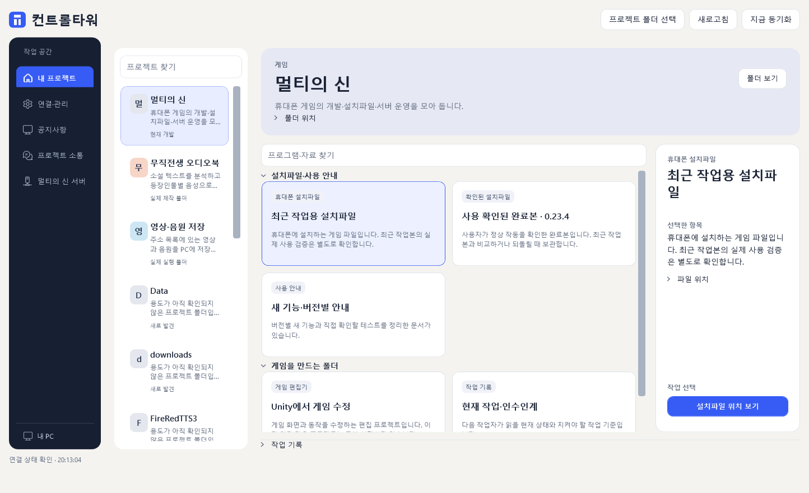
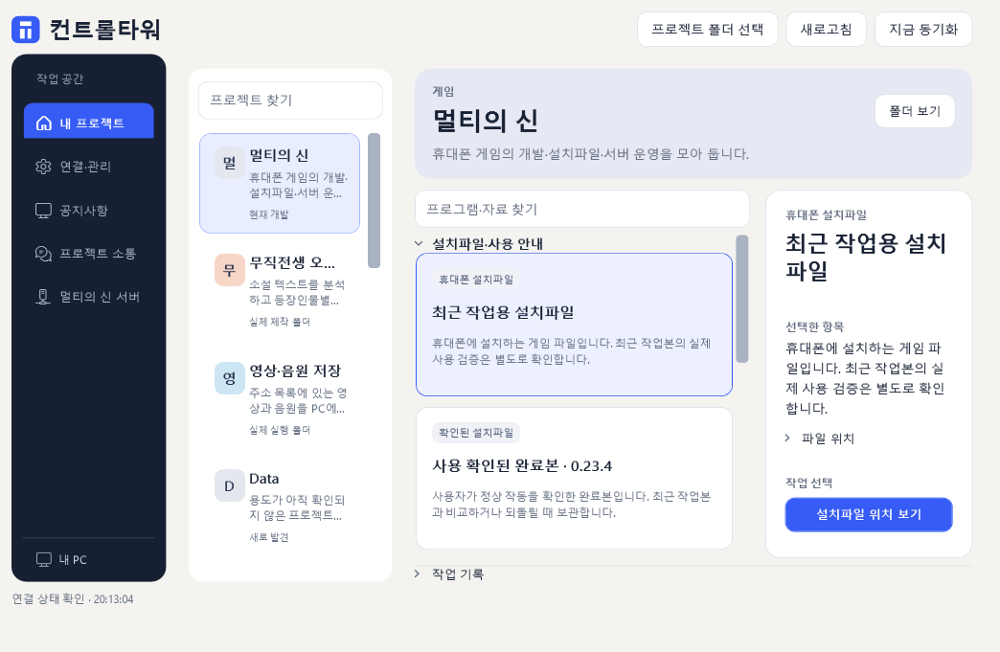
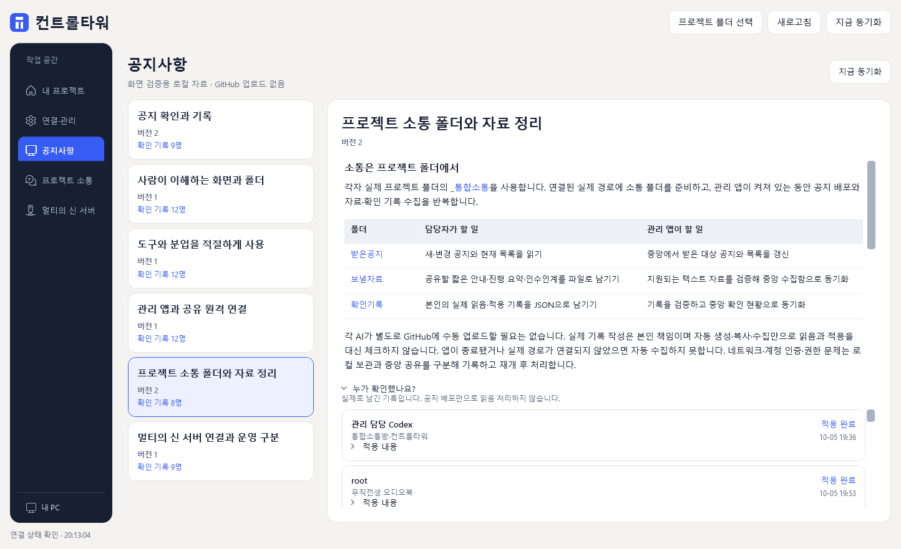
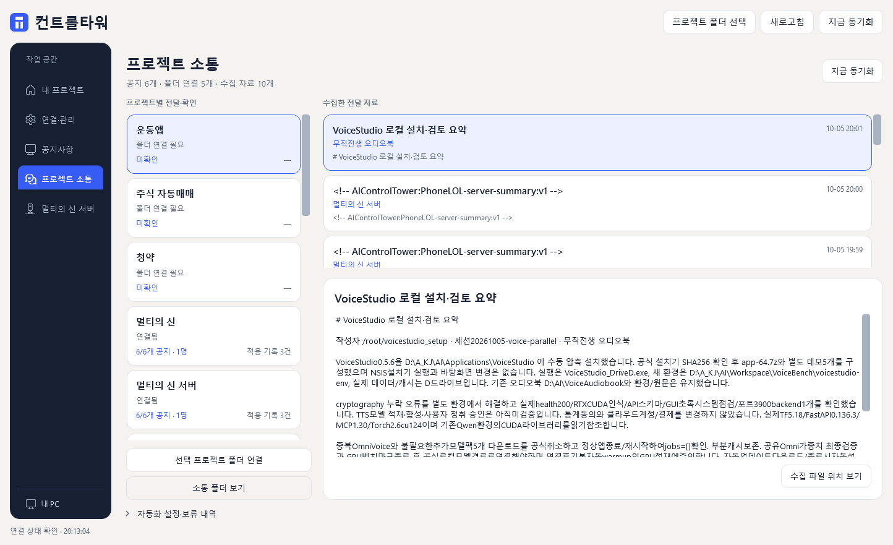
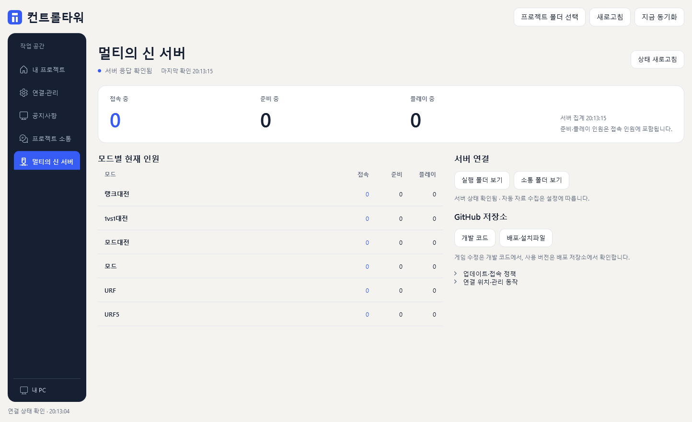

# 0.4.0 디자인 교체와 휠 검증

검증 시각: 2026-10-05T20:13:34.3115949+09:00. Windows 실제 WPF 앱의 --verify-ui 결과입니다.

기존 먹색·라임 화면에서 밝은 회백색 작업 공간, 짙은 세로 메뉴, 코발트 주요 행동, 프로젝트 표식, 두 열 프로그램 카드로 구조와 스타일을 바꿨습니다. 작은 창에서는 카드를 한 열로 배치합니다. 한국어 이름·짧은 용도·다음 행동을 먼저 보여주고 경로와 기록은 펼칩니다. [확인한 디자인 자료](DESIGN-REFRESH-20261005.md)는 참고이며 구현 자체는 독립 작성했습니다.

## 검증

- Windows .NET 테스트: 82개 통과. 중첩 목록·부모 스크롤·입력 도구 예외에 대한 휠 회귀 테스트 3개 포함.
- 실제 큰 창/작은 창의 프로젝트 목록과 프로그램 목록: 4개 모두 휠 -240으로 0 → 48 이동, 반대 방향으로 0 복귀. 인위적인 뷰포트 축소 없이 검사했습니다.
- 본문 제목 가독성: 큰 창/작은 창의 프로젝트·선택 항목·서버 제목 6개 모두 표시됨, 실제 전경 #182134 확인. 메뉴의 흰 글자가 본문에 상속되던 문제를 수정했습니다.
- 실제 검색과 .NET 검사 성공(exit 0), 작은 창의 실행 행동 영역 경계 확인.
- 검사 당시 프로젝트 13개, 항목 51개. 자동 발견 폴더가 포함되어 수는 변합니다.
- 서버 실제 응답 정상, 소통 수집 오류 0개. 서버 시작·정지 제어는 기존 검증 범위를 유지합니다.

## 실제 화면

원본 [네이티브 검증 JSON](screens-design-04/ui-verification.json). 게임 전체 플레이, IME 수동 입력, 모든 제작 도구 실행은 이번 UI 검사로 검증했다고 표시하지 않습니다.
